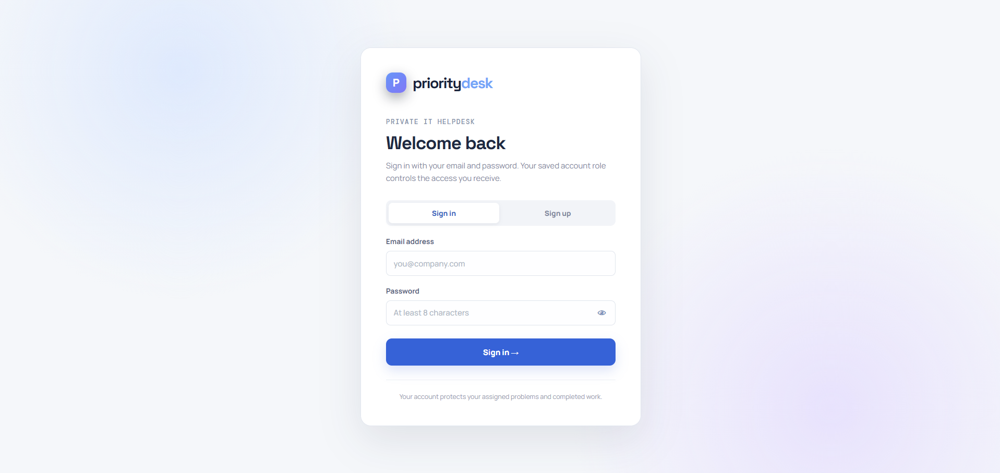
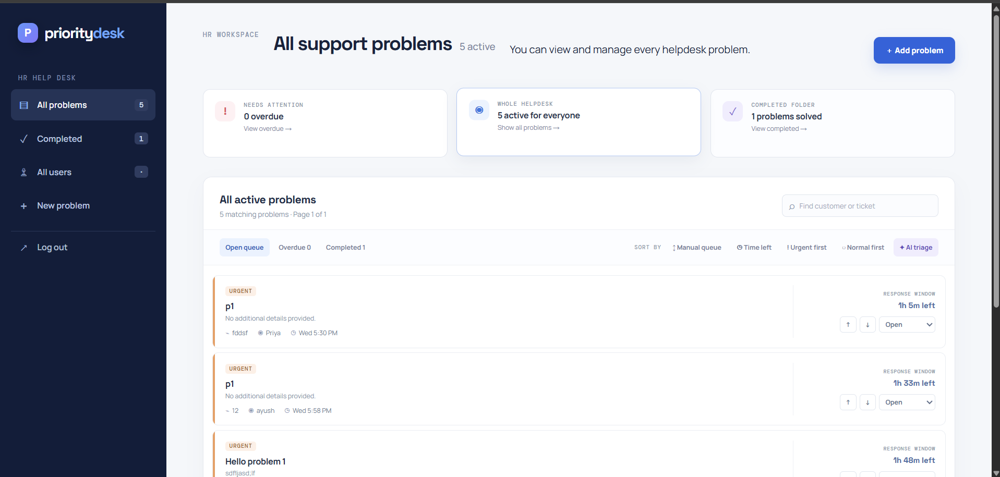
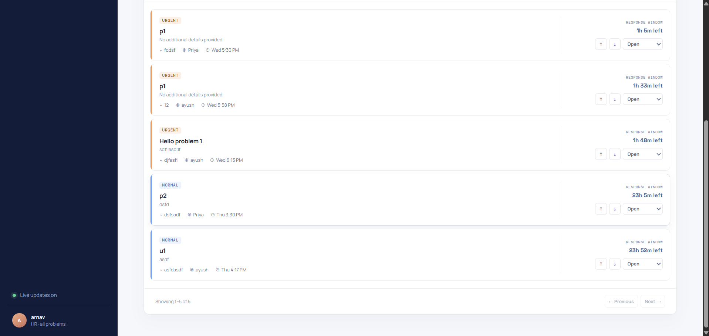
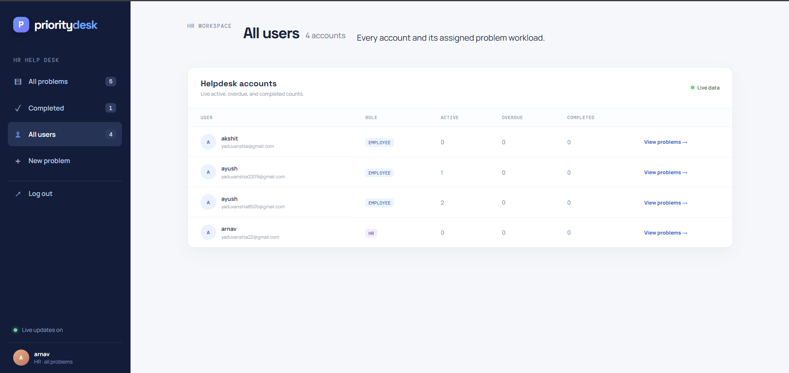
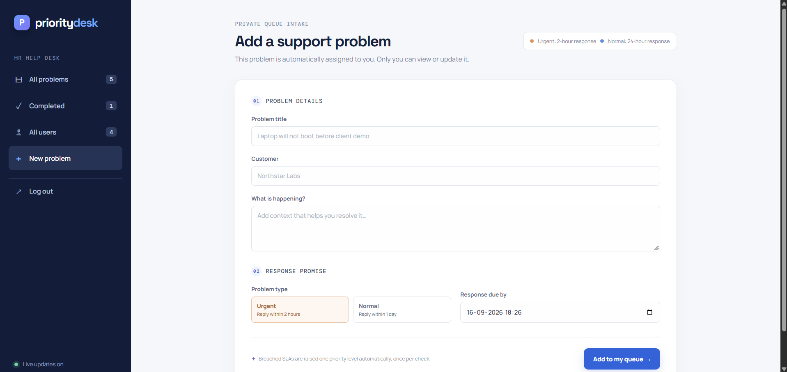

# PriorityDesk

A private IT helpdesk queue. Each user has their own account and can see, create, update, and reorder only problems assigned to them. It supports urgent (2-hour) and normal (24-hour) response promises, a completed folder, manual ordering, deadline ordering, and AI triage.

## Run it

1. Install packages with `npm install`.
2. Copy `.env.example` to `.env`, add a MongoDB Atlas connection string as `MONGODB_URI`, and set a long random `JWT_SECRET`.
3. Run `npm run dev` and visit the address shown for the web app (normally `http://localhost:5173`).

The API runs on port 5000. Vite passes both API and live Socket.IO traffic to it during development.

## Free deployment: Render + MongoDB Atlas

This project is configured to deploy as one free Render web service. Render builds the React interface and the Express server serves it at the same URL, which keeps login, API calls, and live Socket.IO queue updates together.

1. Create a GitHub repository, then upload this project and push it to GitHub:

   ```bash
   git init
   git add .
   git commit -m "Deploy PriorityDesk"
   git branch -M main
   git remote add origin https://github.com/YOUR-USERNAME/prioritydesk.git
   git push -u origin main
   ```

2. In [Render](https://render.com/), choose **New → Blueprint**, select the GitHub repository, and approve the detected `render.yaml` configuration.
3. In Render’s environment-variable screen, set `MONGODB_URI` to your Atlas connection string. Do not put it in GitHub.
4. Click **Apply**. Render installs the React build tools, builds the app, prunes build-only dependencies, then runs `npm start`. It gives you a public `onrender.com` link.

Use an Atlas M0 Free cluster for the database. Atlas Free clusters are suited to small proof-of-concept apps and do not expire. In Atlas, create a database user and allow the Render service to connect; for a simple demo this usually means adding `0.0.0.0/0` to the IP access list, while a production deployment should use a tighter network policy.

Render’s free web service can sleep when unused. The next HTTP request or WebSocket connection wakes it, so the first visit after inactivity can take a little longer. It is great for a portfolio/demo; use a paid always-on plan for a production helpdesk.

## Accounts and privacy

- Sign up with a name, email, and password of at least eight characters.
- Sign-in verifies only email and password, then retrieves the account’s saved Employee or HR role from the server. The Employee/HR selection is made when the account is created.
- Every new problem is assigned to the signed-in user automatically.
- Employee ticket queries and ticket updates are constrained by `assignedTo` on the server. An Employee cannot retrieve, edit, complete, or manually reorder another user’s problem—even by guessing an ID.
- HR accounts can view and manage every helpdesk problem. HR also receives live updates for Employee ticket changes and escalations.
- Completed problems are retained under the **Completed** folder. Changing a completed problem back to Open returns it to the active queue.
- Tickets created before accounts were added have no owner and are intentionally hidden. Re-create them after signing in, or assign their `assignedTo` field to the appropriate MongoDB user record in a one-time migration.


## Live SLA escalation

The server checks breached, unresolved tickets every 60 seconds by default. Each ticket may move **one level per check only**:

`normal → high → urgent`

The original agreed response time stays intact. Completed tickets are never escalated. The priority change is saved in MongoDB and delivered immediately to the assigned user over Socket.IO, which refreshes the queue automatically. Set `ESCALATION_INTERVAL_MS` in `.env` to a larger interval if preferred; the application enforces a 60-second minimum.

### Optional OpenAI triage

Set `OPENAI_API_KEY` in `.env` to enable genuine OpenAI-powered ranking for the current page of tickets when **AI triage** is selected. The key stays on the Express server and is never sent to the browser. `OPENAI_MODEL` defaults to `gpt-5-mini` and can be changed to a model available to your account. Without a key—or if the API is temporarily unavailable—the application continues to work using its built-in priority, deadline, and risk-keyword ranking.

Create your own API key in the OpenAI dashboard; do not use a public or shared key. Ticket title and description data are sent to OpenAI only when AI triage is selected and a key is configured.

## What AI triage means here

The AI triage button always puts overdue tickets first. Without an API key, it uses an explainable server-side score based on problem type, time remaining, and high-risk wording such as “client demo,” “outage,” “locked out,” or “production.” With `OPENAI_API_KEY` configured, the backend asks OpenAI to score the tickets visible on the selected page and then keeps the overdue-first guarantee in code.

## API overview

- `POST /api/auth/signup` and `POST /api/auth/login` create an account or start a session.
- `GET /api/auth/me` returns the signed-in user.
- `GET /api/tickets` supports `page`, `limit`, `view` (`open`, `overdue`, or `completed`), `sort` (`queue`, `time`, `priority`, `normal`, `ai`), and `customer`. It requires a bearer token and returns only the current user’s tickets.
- `POST /api/tickets` creates a ticket assigned to the current user.
- `PATCH /api/tickets/:id` updates the current user’s ticket status.
- `POST /api/tickets/:id/move` swaps a current user’s ticket up or down in their own manual queue.


Some images 





